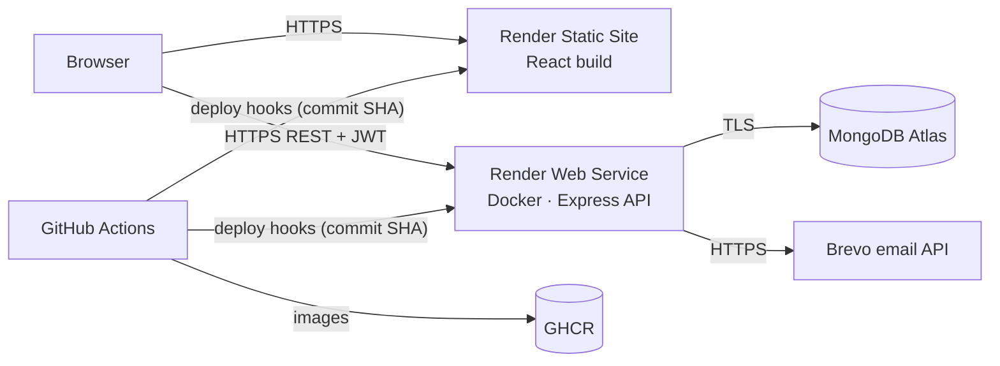

# 🎓 College-Events-hub

[](https://github.com/VedantKaware7/College-events-hub/actions/workflows/ci.yml)
[](https://github.com/VedantKaware7/College-events-hub/actions/workflows/deploy.yml)

A cloud-deployed **college events management platform**. Clubs and departments publish hackathons, cultural fests, workshops, seminars and sports meets. Students discover events, register with email OTP verification, and track approvals. Admins manage events and approve registrations from a dashboard.

| | |
|---|---|
| 🌐 **Live app** | https://college-events-hub.onrender.com |
| 🔌 **REST API** | https://college-events-hub-api2.onrender.com/api/health |
| 👤 **Demo student** | `student@college.edu` / `password123` |
| 🐢 **Note** | Free hosting sleeps when idle, so the first request can take ~50 s |

---

## Problem statement

Colleges announce events through posters, WhatsApp groups and Google Forms. Students miss events, organisers juggle spreadsheets, and seat limits are tracked by hand. College-Events-hub gives every club one portal to publish events, a secure OTP-verified registration flow for students, and an approval dashboard with live seat and fee tracking for organisers.

## Features

- **Discover events:** search, category chips (Technical, Cultural, Sports, Workshop, Seminar, Hackathon), club filter, Upcoming/Past tabs
- **Accounts:** JWT sessions, bcrypt passwords, email OTP account verification
- **Registrations:** OTP-confirmed registration, protection against duplicates and full events, cancellation
- **Admin panel:** statistics and a category chart, event CRUD, approve/reject registrations, paid/unpaid tracking
- **Emails:** OTP and approval emails through the Brevo API (Gmail SMTP locally)

## Tech stack

| Layer | Technology |
|---|---|
| Frontend | React 18, Vite, Tailwind CSS, React Router, Axios |
| Backend | Node.js 20, Express 4, Mongoose 8, JWT, bcryptjs |
| Database | MongoDB Atlas (cloud), MongoDB 7 container (local) |
| Hosting | Render: Docker web service (API) + static site on a CDN (frontend) |
| DevOps | Docker, Docker Compose, nginx, GitHub Actions, GitHub Container Registry, Render Blueprint (IaC) |

## Architecture



**CI/CD:** every push to `main` goes through **CI** (server checks, database seed, API smoke tests, client build, Docker builds). If CI passes, **Deploy to Render** publishes versioned images to GHCR, triggers Render deploys pinned to the commit, waits until `/api/health` reports that commit with the database connected, and smoke-tests production.

## Documentation

| Document | Contents |
|---|---|
| [docs/ARCHITECTURE.md](docs/ARCHITECTURE.md) | Cloud services used, cloud architecture diagram, three-tier design, CI/CD pipeline, **database design (ER diagram)**, CRUD matrix |
| [docs/API.md](docs/API.md) | **REST API documentation** with request/response examples |
| [docs/DEPLOYMENT_RENDER.md](docs/DEPLOYMENT_RENDER.md) | Step-by-step cloud deployment and troubleshooting |
| [postman/](postman/College-Events-hub.postman_collection.json) | Postman collection for every endpoint |
| [render.yaml](render.yaml) | Infrastructure as Code (Render Blueprint) |

## Run locally

**Docker (recommended):**
```bash
docker compose up --build -d
docker compose exec server npm run seed
# open http://localhost:8080
```

**Node.js:**
```bash
cp server/.env.example server/.env   # fill in values
npm install && npm run install:all
npm run seed
npm run dev                          # API :5000, React :5173
```

Without email credentials in `.env`, OTP codes are printed in the server logs.

## Project structure

```
├── client/                React frontend (Dockerfile + nginx.conf for containers)
│   └── src/  api/ components/ context/ pages/ utils/
├── server/                Express REST API (Dockerfile)
│   └── controllers/ models/ routes/ middleware/ utils/ seed.js
├── .github/workflows/     ci.yml · deploy.yml · seed.yml
├── docs/                  ARCHITECTURE.md · API.md · DEPLOYMENT_RENDER.md
├── postman/               API collection
├── render.yaml            Render Blueprint (IaC)
├── docker-compose.yml     Local stack: MongoDB + API + nginx frontend
└── docker-compose.prod.yml  Run published GHCR images
```
