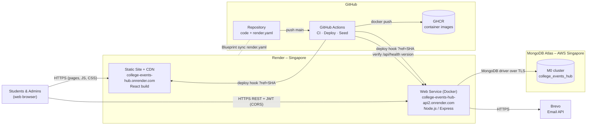
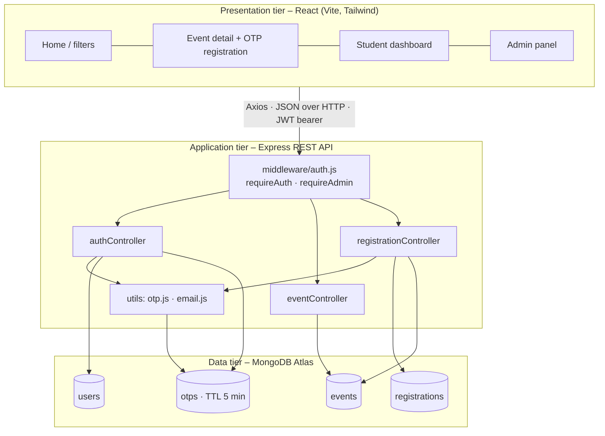
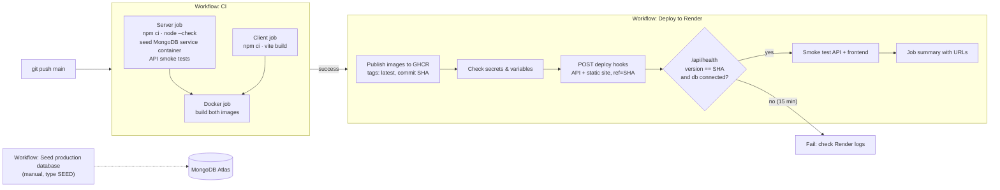
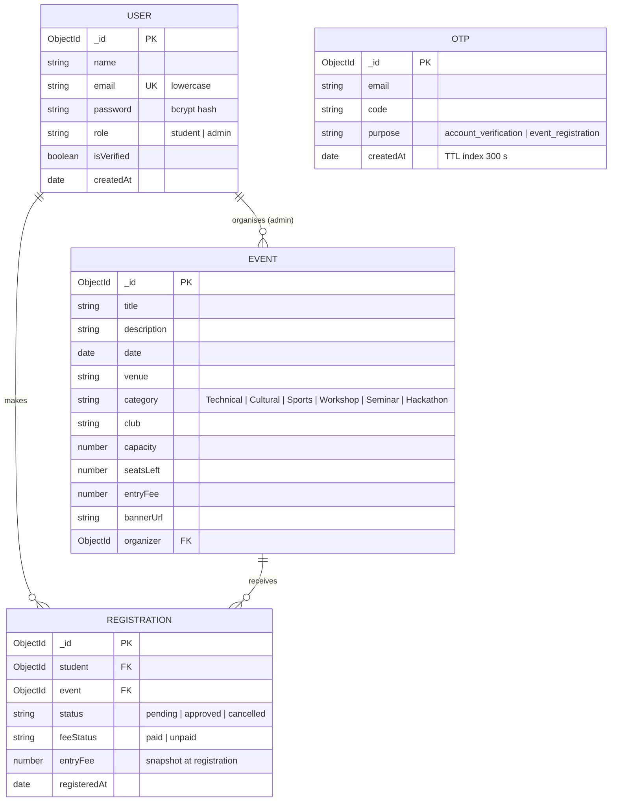

# College-Events-hub – System & Cloud Architecture

## 1. Problem statement

Colleges announce events through posters, WhatsApp groups and Google Forms. Students miss events, organisers track registrations in spreadsheets, and nobody knows how many seats are left.

**College-Events-hub** is a cloud-hosted web application where clubs and departments publish events, and students discover them and register with OTP verification. Organisers approve registrations, track seats and fees, and view statistics.

**Objectives**
- One portal for every event, filterable by category and organising club
- Secure accounts and registrations (JWT, bcrypt, email OTP)
- Full CRUD for events and a registration approval workflow over a REST API
- Cloud deployment with a managed database and automated CI/CD

## 2. Cloud services used

| Service | Type | Role in the project | Why it was chosen |
|---|---|---|---|
| **Render Web Service** (Docker runtime, free plan, Singapore) | PaaS – container hosting | Builds `server/Dockerfile` and runs the Express REST API over HTTPS | Runs our own Docker image with managed TLS, health checks, logs, metrics and rollbacks; no credit card required |
| **Render Static Site** | PaaS – static hosting + global CDN | Serves the React production build with an SPA rewrite and cache headers | Never sleeps, CDN-backed, free |
| **Render Blueprint** (`render.yaml`) | Infrastructure as Code | Declares both services, region, plan, health check, env vars and routes | Infrastructure is versioned and reproducible with the code |
| **MongoDB Atlas** (M0, AWS Singapore) | DBaaS – database | Stores users, events, registrations and OTPs | Fully managed MongoDB with TLS, authentication, backups and a free tier |
| **GitHub Actions** | CI/CD | Tests, builds, publishes images, triggers deploys, verifies health, seeds the DB | Pipeline-as-code next to the source; free |
| **GitHub Container Registry (GHCR)** | Container registry | Stores versioned server and client images (`latest` + commit SHA) | Uses the built-in `GITHUB_TOKEN`, so no extra account is needed |
| **Brevo Transactional Email API** | SaaS – email | Sends OTP codes and approval emails over HTTPS | Render's free tier blocks SMTP; Brevo's API is free (300/day) |

### Cloud computing concepts demonstrated

- **Service models:** PaaS (Render), DBaaS (MongoDB Atlas), SaaS (Brevo, GitHub).
- **Infrastructure as Code:** `render.yaml` defines all hosting infrastructure; `docker-compose.yml` defines the local environment.
- **Containerisation:** the API runs from the same `Dockerfile` in CI, locally and on Render. Images are versioned in GHCR.
- **CI/CD with gated deployment:** auto-deploy is **off**. Render deploys only when GitHub Actions calls a deploy hook, pinned to the exact commit SHA that passed CI.
- **Deployment verification:** the pipeline waits until `/api/health` reports the new commit SHA with the database connected, then smoke-tests production.
- **Twelve-factor configuration:** secrets live in Render environment variables and GitHub Secrets, never in the repo. `JWT_SECRET` is generated by Render.
- **Health checks and self-healing:** Render routes traffic only to instances whose `/api/health` succeeds and restarts unhealthy ones.
- **Observability:** Render logs and metrics, plus a health endpoint reporting database status and the deployed commit.
- **Scale-to-zero:** the free web service sleeps when idle and cold-starts on demand. The UI shows a "waking up" message.
- **Security:** HTTPS everywhere (Render-managed TLS), CORS restricted to the frontend origin, JWT auth, bcrypt hashing, OTP verification, role-based access, security headers on the static site.
- **Rollback:** one-click rollback in Render, and every image is tagged with its commit SHA.

## 3. Cloud architecture diagram

## 4. Application architecture (three tiers)

## 5. CI/CD pipeline

## 6. Database design

MongoDB collections modelled with Mongoose schemas (`server/models/`).

**Design notes**
- `REGISTRATION` has a compound index on `{student, event}` for fast duplicate checks.
- `seatsLeft` is decremented with an atomic `findOneAndUpdate({seatsLeft: {$gt: 0}}, {$inc: -1})`, so two admins approving at once cannot oversell an event.
- `entryFee` is copied onto the registration so later price edits don't change past records.
- OTP documents expire automatically through a MongoDB TTL index.
- Deleting an event cascades to its registrations.

## 7. CRUD matrix

| Resource | Create | Read | Update | Delete |
|---|---|---|---|---|
| Events | `POST /api/events` (admin) | `GET /api/events`, `GET /api/events/:id`, `GET /api/events/filters` | `PUT /api/events/:id` (admin) | `DELETE /api/events/:id` (admin) |
| Registrations | `POST /api/registrations` (student + OTP) | `GET /api/registrations/mine`, `GET /api/registrations` (admin), `GET /api/registrations/stats` (admin) | `PUT /api/registrations/:id/approve` (admin) | `DELETE /api/registrations/:id` (cancel) |
| Users | `POST /api/auth/signup` | `GET /api/auth/me` | `POST /api/auth/verify-otp` (activates account) | – |

Full request and response examples: [API.md](API.md). Postman collection: [`postman/`](../postman/College-Events-hub.postman_collection.json).

## 8. Deployment

Step-by-step: [DEPLOYMENT_RENDER.md](DEPLOYMENT_RENDER.md).
